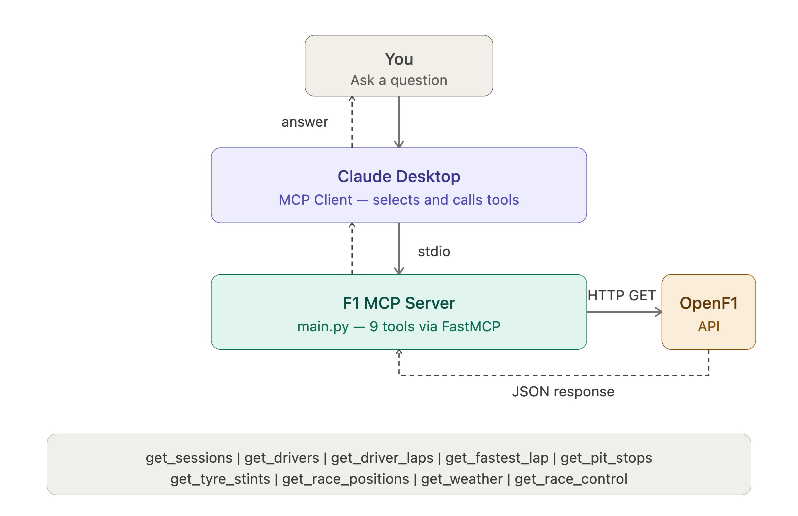
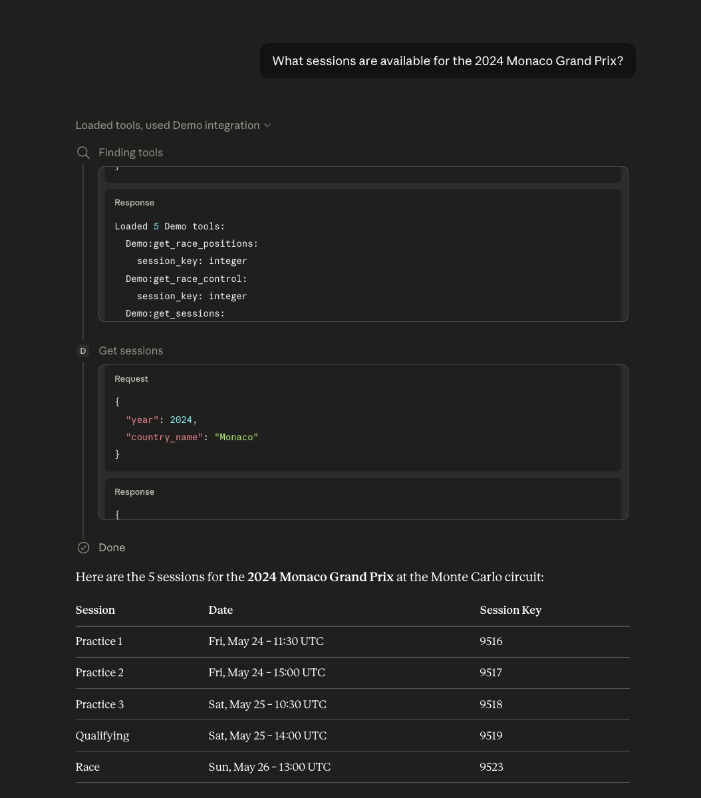
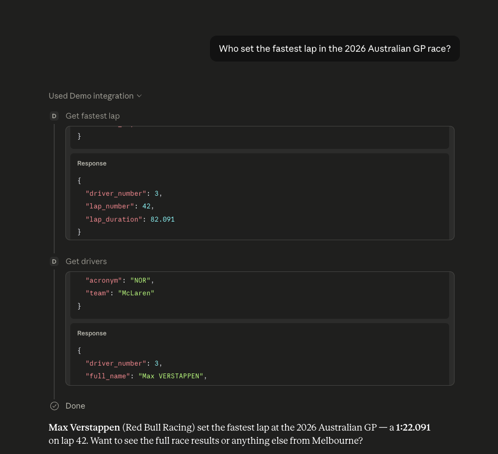
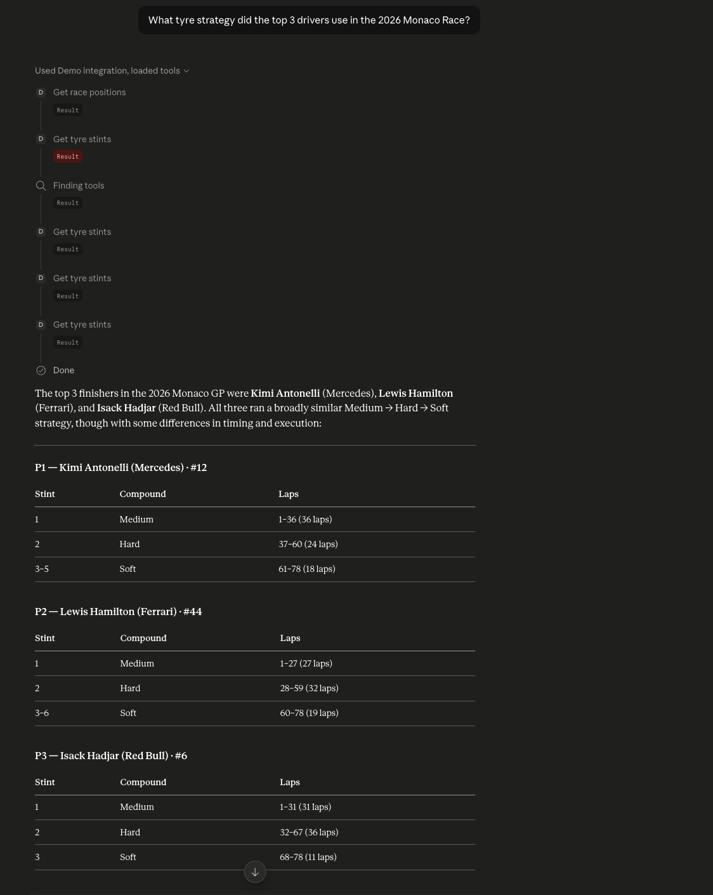

# 🏎️ F1 MCP Server

A real-time Formula 1 analytics server built with the **Model Context Protocol (MCP)**. Ask Claude natural language questions about F1 races, lap times, tyre strategies, pit stops, and more — powered by live data from the [OpenF1 API](https://openf1.org).

> "What tyre strategy did the top 3 drivers use in the 2026 Monaco Race?"
> "Who set the fastest lap at the 2026 Australian GP?"
> "Was there a safety car at the 2024 British GP?"

---

## 🏗️ Architecture



---

## ⚙️ How It Works

Claude Desktop acts as the **MCP client**. On startup, it boots the F1 MCP server as a local subprocess and communicates via **stdio** (standard input/output). When you ask a natural language question, Claude reads the tool definitions and docstrings, decides which tools to call (and in what order), fires the OpenF1 API requests, and synthesizes the response — all automatically.

No API key required. No authentication. Just live F1 data.

---

## 🛠️ Tools

| Tool | Description |
|------|-------------|
| `get_sessions` | Find all sessions for a year/country (Race, Qualifying, Practice, Sprint) |
| `get_drivers` | List all drivers in a session with number, name, and team |
| `get_driver_laps` | All lap times and sector times for a specific driver |
| `get_fastest_lap` | Fastest lap across all drivers in a session |
| `get_pit_stops` | Pit stop laps and durations for a session |
| `get_tyre_stints` | Full tyre strategy — compound, stint number, lap range |
| `get_race_positions` | Final finishing positions for all drivers |
| `get_weather` | Track temp, air temp, humidity, wind, and rainfall |
| `get_race_control` | Safety cars, flags, penalties, and incidents |

---

## 💬 Example Queries

```
What sessions are available for the 2026 season?
Who set the fastest lap in the 2026 Australian GP?
What tyre strategy did the top 3 use in the 2026 Monaco Race?
Did it rain during the 2024 British GP qualifying?
Were there any safety cars in the 2024 Monaco Race?
What were Hamilton's lap times in the 2026 Monaco Race?
How long were Verstappen's pit stops in the 2024 Abu Dhabi GP?
```

---

## 📸 Screenshots

### Sessions Query


### Fastest Lap — Auto Tool Chaining


### Tyre Strategy — Multi-Tool Chain


---

## 🚀 Setup

### Prerequisites
- Python 3.10+
- [uv](https://docs.astral.sh/uv/) package manager
- [Claude Desktop](https://claude.ai/download)

### Installation

```bash
# Clone the repo
git clone https://github.com/kevinjohnson/F1-MCP-Server.git
cd F1-MCP-Server

# Install dependencies
uv add "mcp[cli]" requests

# Register with Claude Desktop
uv run mcp install main.py
```

Then fully quit and reopen Claude Desktop. The F1 Assistant will appear under **Connectors**.

### Common Issue
If the server shows as "Server not found", make sure `main.py` ends with:
```python
if __name__ == "__main__":
    mcp.run()  # No transport argument — stdio only
```

---

## 📡 Data Source

All data comes from [OpenF1](https://openf1.org) — a free, open-source API providing real-time and historical F1 telemetry from 2023 onwards.

- No API key required for historical data
- Rate limit: 3 req/s, 30 req/min (free tier)
- Data available from 2023 season onwards

---

## 🧠 Why MCP?

Claude can't access live data or external APIs on its own. MCP (Model Context Protocol) bridges that gap — it lets you define **tools** as Python functions that Claude can call autonomously. The key insight: Claude reads your **docstrings** to decide when and how to use each tool, enabling it to chain multiple API calls together without any explicit instructions.

In this project, a single question like *"What tyre strategy did the top 3 use?"* triggers Claude to automatically: find the session key → get race positions → resolve driver numbers → fetch tyre stints for each driver — all from one natural language prompt.

---

## 📁 Project Structure

```
F1-MCP-Server/
├── main.py          # MCP server with all 9 tools
├── pyproject.toml   # uv project config
├── images/          # Screenshots and architecture diagram
└── README.md
```

---

## 🔭 Potential Extensions

- Add `get_car_telemetry` — throttle, brake, DRS, gear data per lap
- Add `get_overtakes` — position change events during a race
- Add `get_championship_standings` — driver and constructor standings
- Cache session keys locally to reduce API calls
- Add a `compare_drivers` tool for head-to-head lap time analysis

---

Built by [Kevin Johnson](https://github.com/Kevin29Johnson) · Powered by [OpenF1](https://openf1.org) · Built with [MCP](https://modelcontextprotocol.io)